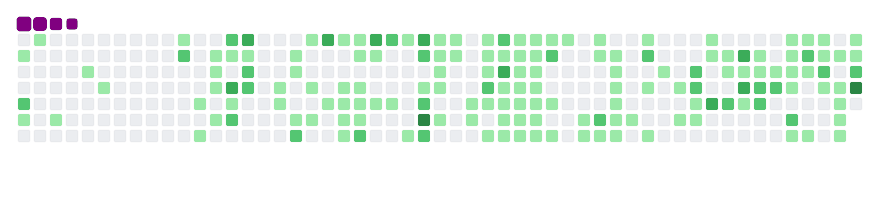

> I like coding by night, interested in everything :D

 

  
 <h2> :trophy: Github Stats </h2> 

  
  <a href="https://profile-summary-for-github.com/user/miloud2000" target="_blank">
    👉 Profile summary
  </a>
  
   
  
  <table width="100%" style="width: 100%;">
    <tbody>
      <tr>
        <td>
          
        </td>
        <td>
          
        </td>
      </tr>
      <tr>
        <td colspan="2">
          

            
          

        </td>
      </tr>
      <tr>
        <td colspan="2">
          

            
          

        </td>
      </tr>
    </tbody>
  </table>
  

  

  

 

  
 <h2> :mag: Currently learning </h2> 

  
  

  
  
  
  
  
  
  
  

  

 

  
 
    <h2> :star: Prefered Tools/Langs </h2> 
  

  

  
  
  
  
  
  

  
  
  
 
  

  

  
  
  
  
  
  
  
  

  
  
 
  
  
  
  
  <!-- add kibana --> 
  
  
  
  
  

  
  
  
  
  
  
  
  
  
  
  
  
  
  
  
  

 

  
 <h2> :link: Reach me </h2> 

 

  

  
<!--   
 -->

  
<!--  -->

<!-- <a href="http://localhost/my-username_is/miloud2000#9511" target="_blank">

miloud2000#9511
</a> -->

  

 

  
 <h2> 🦆 More fun stuff </h2> 

  

  

   
  
  ## My Contribution Graph Get Eaten By the Snake 🐍:
  <!--  -->
   
  
  
   

  

